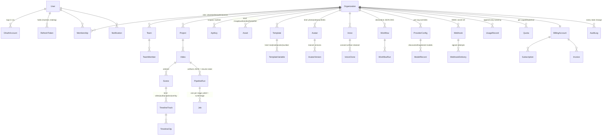

# SurfGen — Entity-Relationship Overview

Status: Living document · Source of truth: [`packages/db/prisma/schema.prisma`](../../packages/db/prisma/schema.prisma) (34 models). This doc explains the shape and the reasoning; the schema file wins on details.

## Conventions

- Every org-scoped entity: `id` (cuid), `orgId`, `createdAt`, `updatedAt`, `deletedAt` (soft delete — reads filtered by the Prisma extension in `packages/db/src/index.ts`).
- Enums mirror the domain state machines in `packages/core` (`VideoStatus`, `JobStatus`, `RunStatus`) — the DB stores states; the *transitions* are enforced in code by `TransitionTable`.
- Money/usage rows are append-only; no row is ever mutated after creation (`UsageRecord`, `AuditLog`, `WebhookDelivery`, `OutboxEvent`).

## Domain clusters



Plus two standalone tables: `Plugin` (installed plugin registry + manifest snapshot) and `OutboxEvent` (transactional outbox — written in the same transaction as domain changes, relayed to RabbitMQ by `OutboxRelay`).

## Cluster notes

### Identity & tenancy
`Membership.role` is the single RBAC source (`OrgRole` enum); guards rank roles `viewer < editor < admin < owner`. `ApiKey` stores only a sha256 hash + scopes; `RefreshToken` rows are rotated on every refresh (old row revoked), which makes token theft detectable via reuse.

### Video authoring
`Video → Scene → TimelineTrack → TimelineClip` is the editor's document model; the pipeline reads it, never writes it. `Template` + `TemplateVariable` let a video be instantiated from a parameterized design.

### Execution
`PipelineRun.artifacts` (JSON) maps `stage → artifact refs`. This is the crash-safety mechanism: a restarted stage first checks for its artifact and no-ops if present, so at-least-once delivery converges to exactly-once effects. `Job` rows carry per-stage status/progress/error for the UI; BullMQ holds the ephemeral copy.

### Provider management
`ProviderConfig` stores per-org provider enablement/priority overrides — the DB layer of the config precedence chain (file config is deployment-wide; this table is org-specific). Secrets are stored as references (`env:`/`vault:`/`file:`), never as material.

### Governance
`UsageRecord` is the metering primitive (capability, provider, units, cost hint) that billing aggregates into `Invoice`. `AuditLog` rows come from the API's audit interceptor: actor, org, action, resource, IP.

## Scale & partitioning posture

Hot append-only tables (`Job`, `UsageRecord`, `AuditLog`, `OutboxEvent`, `WebhookDelivery`) are keyed by `(orgId, createdAt)` and contain no cross-row constraints, so they can move to native Postgres partitioning by month without schema redesign (see [NFR SCA-6](../product/non-functional-spec.md)).

## Regenerating this view

```bash
pnpm --filter @surfgen/db exec prisma generate   # client
pnpm --filter @surfgen/db exec prisma migrate dev # against local compose stack
```

The first migration is generated on the first `scripts/install.sh` run with Docker up (deliberately not committed from a machine without a database — see build state notes).
