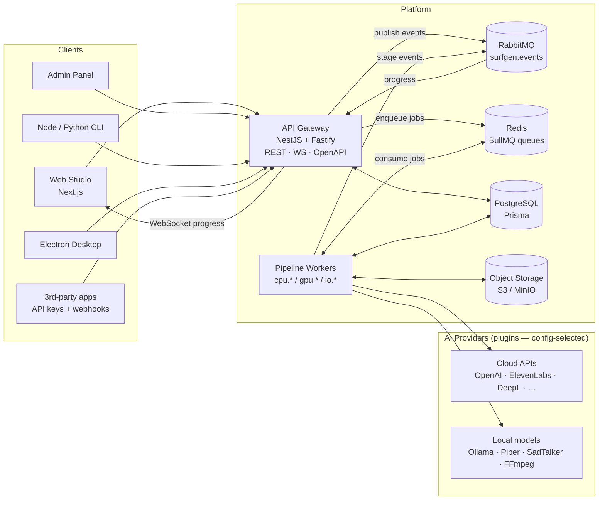
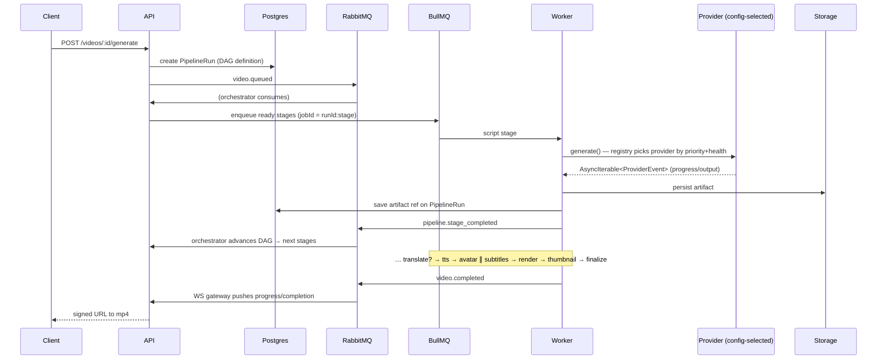

# SurfGen — High-Level Architecture

Status: Living document · Related: [Low-Level Architecture](./low-level-architecture.md), [ERD](./erd.md), [ADRs](./adr/), [Non-Functional Spec](../product/non-functional-spec.md)

## 1. System context

SurfGen is an open-source, provider-agnostic AI video generation platform. Users author videos (script, avatar, voice, language) in a web studio, CLI, or via API; a distributed pipeline turns the request into a rendered mp4 using whichever AI providers the deployment's configuration selects — cloud APIs or locally hosted models, interchangeably.

## 2. Architectural style

Three complementary patterns, each applied where it earns its keep (see ADRs 001–003):

1. **Hexagonal (ports & adapters).** The domain core (`packages/core`) is framework-free with zero runtime dependencies. It defines *ports* (`StoragePort`, `EventPublisherPort`, `JobQueuePort`, `ClockPort`, `UnitOfWorkPort`); infrastructure packages provide adapters (S3/local storage, RabbitMQ/in-memory events, BullMQ queues). Applications (`apps/api`, `apps/workers/*`) wire adapters to ports via DI.
2. **Provider abstraction as the product.** All 15 AI capabilities sit behind `AIProvider<TIn, TOut>` in `packages/ai-sdk`. A `ProviderRegistry` resolves `capability → provider chain` from `config/ai.yaml` with priority ordering, health-gated failover, and per-org overrides. Vendors exist only inside `plugins/*`. Swapping cloud ↔ local is a YAML edit, proven by an executable gate test.
3. **Event-driven pipeline.** Video generation is a DAG of stages orchestrated by reacting to domain events (`video.queued`, `pipeline.stage_completed`, `pipeline.stage_failed`) — no long-lived saga process. State lives in Postgres (`PipelineRun.artifacts`), making the orchestrator stateless, crash-safe, and resumable.

## 3. Monorepo topology

| Layer | Packages | Depends on |
|---|---|---|
| Domain | `core` | — (zero deps) |
| Capability SDK | `ai-sdk`, `plugin-sdk` | core |
| Infrastructure | `config`, `events`, `storage`, `queue`, `db`, `telemetry` | core |
| Providers | `plugins/*` (mock-suite, llm-ollama, llm-openai, tts-piper, tts-elevenlabs, translation-deepl, …) | ai-sdk, plugin-sdk |
| Applications | `apps/api`, `apps/workers/pipeline`, `apps/web`, `apps/cli`, `apps/cli-py`, `apps/desktop`, `apps/admin` | everything above |
| Proof | `packages/integration` | all (the provider-swap gate lives here) |

Dependency rule: arrows point downward only. Nothing below "Providers" may import a vendor SDK or name a vendor.

## 4. Video generation flow (happy path)

Failure path: a stage exhausts BullMQ retries → `pipeline.stage_failed` → run marked failed → `video.failed` → WS + webhook notification. Cancellation: Redis flag `surfgen:cancel:{jobId}` polled by workers → `UnrecoverableError`.

## 5. Data plane vs. control plane

- **Control plane** (Postgres): orgs, projects, videos, runs, jobs, providers, quotas, audit. Source of truth; the outbox table bridges DB transactions to RabbitMQ reliably.
- **Data plane** (object storage): all media under `org/<orgId>/<area>/<id>/<file>` with sanitized segments; clients only ever receive signed URLs.
- **Ephemeral plane** (Redis): queues, rate limits, cancellation flags, health caches. Fully rebuildable.

## 6. Deployment shapes

| Shape | What runs | Use |
|---|---|---|
| Laptop / zero-cred | compose dev stack + Piper + FFmpeg + mocks | contributor onboarding, demos |
| Single VM | docker-compose.full.yml (+ observability, ollama profiles) | small teams, self-hosters |
| Kubernetes | Helm chart: api Deployment, per-queue-class worker Deployments (HPA on queue depth), web; managed PG/Redis/MQ/S3 | production scale |

GPU stages are just queue classes: a deployment with no GPUs simply routes `gpu.*` capabilities to cloud providers via `ai.yaml` — same code, different config.

## 7. Cross-cutting concerns

- **Observability:** pino JSON logs (redacted), Prometheus metrics, OTel traces propagated api → queue → worker → provider. Dashboards + alert rules in `infra/monitoring`.
- **Security:** JWT + API keys, org RBAC guards, zod at boundaries, secret-reference-only config, HMAC-signed webhooks, audit interceptor. See [non-functional spec §4](../product/non-functional-spec.md).
- **Multi-tenancy:** every entity org-scoped; storage keys org-prefixed; per-org provider overrides and quotas.
