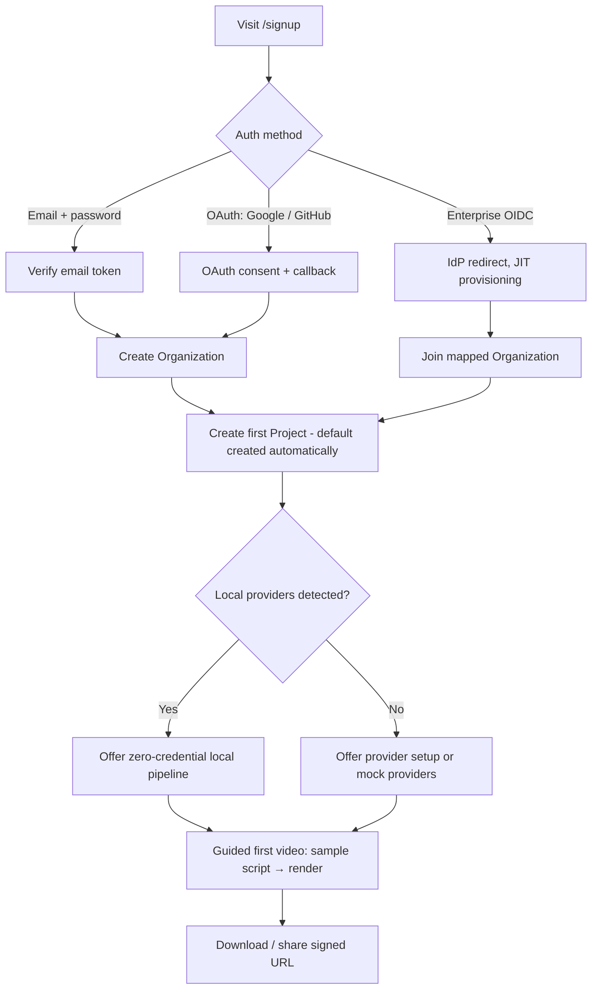
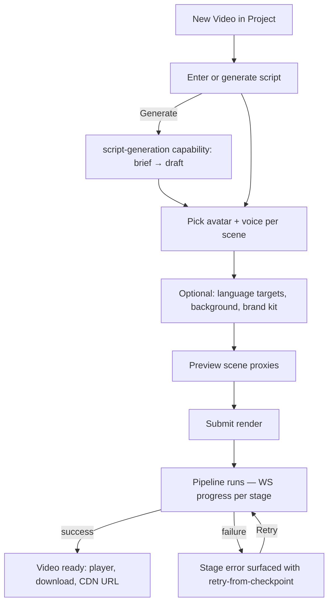
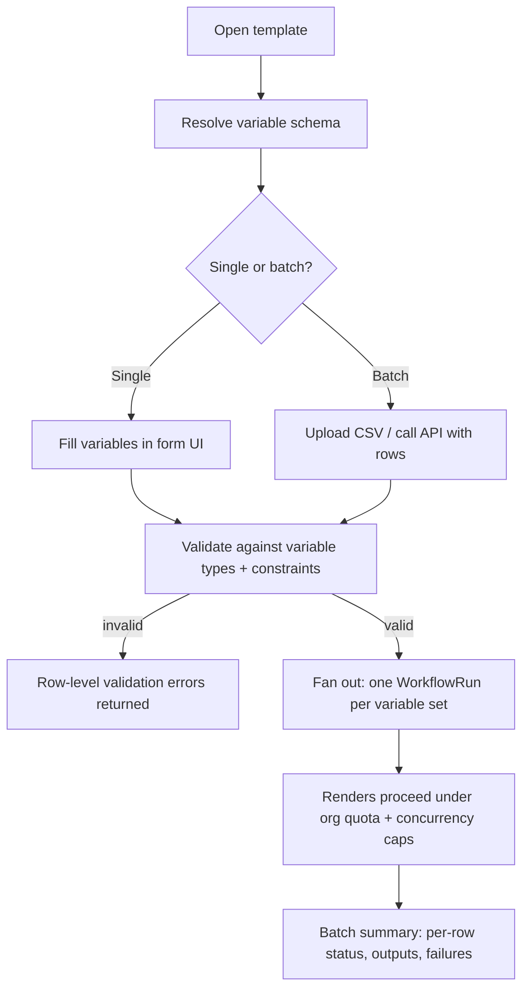
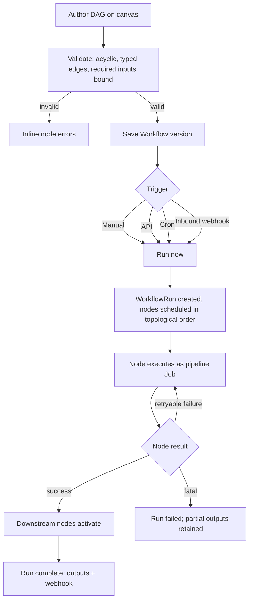
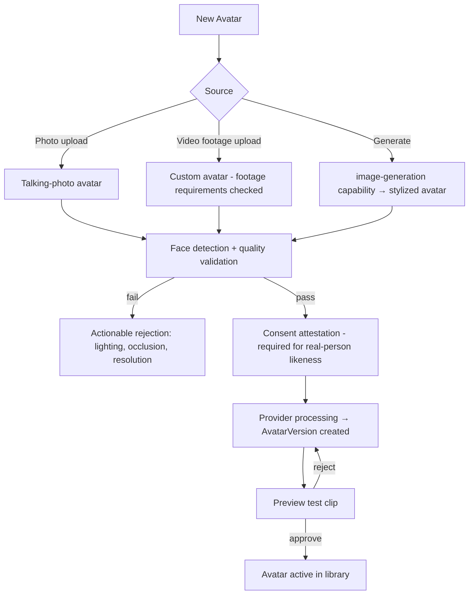
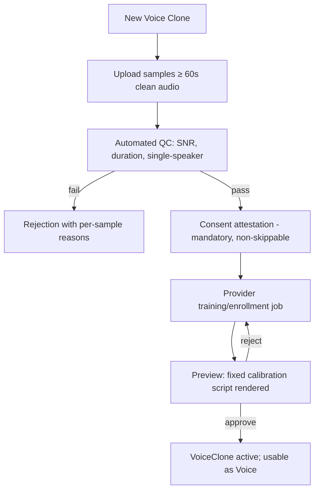

# SurfGen — Functional Specification

| | |
|---|---|
| **Status** | Approved |
| **Version** | 1.0 |
| **Related docs** | [PRD](./PRD.md) · [Non-Functional Spec](./non-functional-spec.md) · [Low-Level Architecture](../architecture/low-level-architecture.md) · [API Overview](../api/README.md) |

This document specifies observable system behavior. Architecture rationale lives in the architecture docs and ADRs.

---

## 1. User Flows

### 1.1 Onboarding

Behavioral requirements:

- Signup creates `User`, a personal `Organization` (unless joining via invite/OIDC mapping), a `Membership(role=owner)`, and a default `Project`.
- Email verification is required before any render job is accepted (configurable by operator, default on).
- OIDC just-in-time provisioning maps IdP groups to roles via operator-configured claim rules.
- The guided first video must be completable with **zero external credentials** when local providers are discovered.

### 1.2 Create Video from Script

Behavioral requirements:

- Script text is chunked into `Scene` records; scene boundaries are editable.
- Submitting a render creates a `Video` (status `queued`), a `WorkflowRun` against the built-in pipeline definition, and one `Job` per stage as stages activate.
- Progress is streamed over WebSocket (§8 protocol in low-level architecture) and mirrored by polling `GET /v1/videos/:id`.
- A failed stage may be retried from its checkpoint without re-running completed stages.

### 1.3 Template-Based Generation

Behavioral requirements:

- Batch size limit default 1,000 rows per request (operator-configurable); rows validate independently — a bad row never blocks good rows.
- Batch runs are grouped under a `batchId` for aggregate status queries and a single `batch.completed` webhook.

### 1.4 Workflow Builder Run

Behavioral requirements:

- Saving creates an immutable workflow **version**; running always pins a version.
- Node inputs/outputs are typed; the editor refuses edges with incompatible types.
- Every node execution is a `Job` row — same retry/checkpoint semantics as the built-in pipeline (they share one engine).

### 1.5 Avatar Creation

Behavioral requirements:

- Real-person likeness requires a recorded consent attestation (stored artifact + `AuditLog` entry) before processing begins.
- Avatars are versioned (`AvatarVersion`); videos pin the version used, so avatar updates never silently change existing videos.

### 1.6 Voice Cloning

Behavioral requirements:

- Consent artifact (signed statement or verification recording) is stored with the `VoiceClone` and referenced in the audit trail; API-created clones must pass a `consentToken`.
- Clones are org-scoped and never listed publicly.

## 2. Pipeline Stage Behavior

The built-in video pipeline is a declarative definition executed by the shared workflow engine. Stages run as BullMQ jobs on `cpu.*` or `gpu.*` queues; every stage is idempotent, checkpointed, and cancellable.

`script → prompt-enhance → translate → tts → avatar-animate → lipsync → motion → subtitles → render → compress → thumbnail → store → cdn-publish → webhook → analytics`

| # | Stage | Queue | Input | Output | Behavior & rules | Skip condition |
|---|---|---|---|---|---|---|
| 1 | `script` | cpu | Brief/document/raw text | Normalized script, scene segmentation | If raw text: normalize, segment into scenes (max scene duration configurable, default 30s speech). If brief: invoke script-generation capability. Persists scenes. | Never (entry stage) |
| 2 | `prompt-enhance` | cpu | Script scenes | Enhanced scenes + downstream hints | LLM pass that fixes pronunciation hints (SSML), expands abbreviations, tags emphasis/emotion per scene. Original preserved; diff stored. | `pipeline.promptEnhance=false` |
| 3 | `translate` | cpu | Enhanced script, target locales | Per-locale script variants | One variant per target locale via translation capability. Locale fan-out multiplies downstream stages per variant. Length-delta warnings emitted when translated speech duration diverges > 20%. | No target locales |
| 4 | `tts` | cpu/gpu | Scene text + voice ref | Per-scene audio (wav 48kHz) + phoneme/word timings | Provider resolved per org policy. Emits word-level timings when the provider supports them; otherwise a forced-alignment fallback (whisper) runs. Per-scene caching keyed by (text, voice, provider, params) hash. | Audio-upload videos |
| 5 | `avatar-animate` | gpu | Avatar version + audio | Raw avatar performance video per scene | Renders the avatar performing the audio. GPU slot scheduling; per-provider concurrency from `capabilities()`. | No avatar (voiceover-only video) |
| 6 | `lipsync` | gpu | Performance video + audio | Lip-corrected video | Runs only when the avatar provider doesn't guarantee sync (declared in `CapabilityDescriptor.guaranteesLipSync`). | Provider guarantees sync |
| 7 | `motion` | cpu | Scene assets + timeline | Motion plan (keyframes) | Compiles camera moves, transitions, kinetic text into a deterministic keyframe plan for the renderer. Uses motion-generation capability if configured, else built-in presets. | Static template |
| 8 | `subtitles` | cpu | Audio + timings + locale variants | SRT/VTT sidecars + styled caption track | Uses TTS timings when available, else ASR. Produces one track per locale. Burn-in decided by video settings. | Subtitles disabled |
| 9 | `render` | cpu (ffmpeg) / gpu | All scene assets + motion plan + captions | Master video (mezzanine, per locale) | Deterministic FFmpeg composition graph — the zero-credential reference path ([ADR-010](../architecture/adr/ADR-010-ffmpeg-local-render-reference.md)). Scene-level render checkpoints; resume re-renders only missing scenes. | Never |
| 10 | `compress` | cpu | Master video | Delivery renditions (H.264/H.265/AV1 ladder) | Rendition ladder from `video.yaml`. Two-pass or CRF per config. | Operator disables ladder |
| 11 | `thumbnail` | cpu | Master video | Poster + preview sprite sheet + animated preview | Poster frame at first avatar-visible frame (face-detection heuristic) unless user pinned one. | User-pinned thumbnail |
| 12 | `store` | cpu | All artifacts | Durable objects + `Asset` rows | Writes to the storage port (any S3-compatible target). Content-addressed keys; checksums recorded. | Never |
| 13 | `cdn-publish` | cpu | Stored objects | Public/signed delivery URLs | Publishes per distribution policy (public CDN path or signed-URL-only). Cache-control headers per asset class. | Private-only videos |
| 14 | `webhook` | cpu | Video + run metadata | Delivered `video.completed` events | Enqueues deliveries to all matching webhook subscriptions (§6). Delivery is at-least-once. | No subscriptions |
| 15 | `analytics` | cpu | Run metadata | `UsageRecord` rows + metrics | Writes usage records (duration, provider, compute class, cost estimate), emits OTel metrics. Runs even for failed pipelines (records the failure). | Never |

Cross-cutting stage rules:

- **Retry:** default 3 attempts, exponential backoff with jitter (base 5s, cap 5m); GPU stages get 2 attempts before failover to the next provider in the capability chain.
- **Cancellation:** cooperative — workers check a cancellation flag between chunks; in-flight provider calls are aborted where the runner supports it; partial artifacts are garbage-collected.
- **Checkpoints:** each stage persists a checkpoint document (stage, sceneIds done, artifact refs). Resume skips completed work at scene granularity.
- **Idempotency:** stage outputs are content-addressed; re-execution with identical inputs is a cache hit.

## 3. Template Variable Resolution

### 3.1 Variable declaration

Each `TemplateVariable` declares: `key` (snake_case, unique per template), `type`, `required`, `default`, `constraints`, and `scope` (which scenes/layers consume it).

| Type | Value format | Constraints available |
|---|---|---|
| `text` | UTF-8 string | minLength, maxLength, regex |
| `rich_text` | Sanitized HTML subset | maxLength, allowedTags |
| `image` | Asset ID or fetchable URL | mimeTypes, maxBytes, minDimensions |
| `video` | Asset ID or fetchable URL | mimeTypes, maxBytes, maxDuration |
| `audio` | Asset ID or fetchable URL | mimeTypes, maxBytes, maxDuration |
| `color` | Hex / oklch string | palette lock to brand kit |
| `url` | https URL | allowedDomains |
| `select` | One of declared options | options list (required) |

### 3.2 Resolution rules (evaluated in order)

1. **Explicit value** provided in the generation request (form, CSV row, or API body).
2. **Org default** — an organization may pin defaults for brand-kit-scoped variables (e.g. `{{brand_color}}`).
3. **Template default** declared on the variable.
4. **Required + unresolved → validation error** for that row/request (error code `TEMPLATE_VARIABLE_MISSING`, includes the variable key). Optional + unresolved → the bound layer collapses (text layers render empty; media layers are removed and the layout reflows per template author's collapse rule).

Additional rules:

- Substitution syntax is `{{variable_key}}`; escaping via `\{\{literal\}\}`. Unknown keys in template content are a template validation error at save time, not at run time.
- Values are validated against constraints **before** any job is enqueued; URL-typed media is fetched and checksummed at resolution time (fetch failure = row failure, `TEMPLATE_VARIABLE_FETCH_FAILED`).
- Text variables consumed by the script layer re-enter the pipeline at the `tts` stage (they change speech); variables consumed only by visual layers re-enter at `render` — the resolver computes the earliest affected stage to maximize cache reuse.
- Resolution is pure: same template version + same variable set = same resolved definition (hashable for idempotency).

## 4. Workflow Node Types

| Category | Node | Inputs → Outputs | Notes |
|---|---|---|---|
| Trigger | `trigger.manual` | — → `payload` | Run button / API run |
| Trigger | `trigger.cron` | — → `payload{firedAt}` | Operator-limited min interval |
| Trigger | `trigger.webhook` | HTTP body → `payload` | Per-workflow signed inbound URL |
| AI | `ai.script`, `ai.prompt_enhance`, `ai.translate`, `ai.tts`, `ai.avatar_animate`, `ai.lipsync`, `ai.motion`, `ai.subtitles`, `ai.image`, `ai.video_gen`, `ai.llm` | Capability-typed | One node per capability; provider override selectable per node |
| Media | `media.render`, `media.compress`, `media.thumbnail`, `media.concat`, `media.trim` | Media-typed | FFmpeg-backed |
| Data | `data.template_resolve` | template + variables → resolved definition | §3 semantics |
| Data | `data.map` | array → per-item sub-branch | Fan-out with concurrency cap |
| Data | `data.transform` | JSON → JSON (JMESPath/JSONata expression) | Sandboxed, no arbitrary code |
| Control | `control.branch` | condition → true/false edges | Expression over upstream outputs |
| Control | `control.wait_all` | N edges → 1 | Join for parallel branches |
| Control | `control.approval` | — → approved/rejected | Human-in-the-loop gate, notifies approvers |
| I/O | `io.http` | request spec → response | Egress allowlist enforced |
| I/O | `io.storage_write` | artifact → Asset | Storage port |
| I/O | `io.webhook_out` | payload → delivery | Signed like all webhooks |
| Output | `output.video`, `output.asset`, `output.json` | terminal | Defines run outputs |

Validation at save time: DAG must be acyclic, every non-trigger node reachable from a trigger, all required inputs bound, edge types compatible, at least one output node.

## 5. RBAC Role Matrix

Roles exist at **organization** scope and may be overridden (narrowed or widened up to the member's org ceiling) at **project** scope. A project role never exceeds what the org role permits for org-level actions.

| Permission | Owner (org) | Admin (org) | Editor (org) | Viewer (org) |
|---|---|---|---|---|
| Billing, plan, delete org | ✅ | ❌ | ❌ | ❌ |
| Manage members & roles | ✅ | ✅ | ❌ | ❌ |
| Configure SSO/OIDC | ✅ | ✅ | ❌ | ❌ |
| Manage provider config / plugins | ✅ | ✅ | ❌ | ❌ |
| Manage org webhooks & API keys | ✅ | ✅ | ❌ | ❌ |
| View audit log | ✅ | ✅ | ❌ | ❌ |
| Create/delete projects | ✅ | ✅ | ✅ (create only) | ❌ |
| Create/edit videos, templates, workflows | ✅ | ✅ | ✅ | ❌ |
| Trigger renders / workflow runs | ✅ | ✅ | ✅ | ❌ |
| Create avatars / voice clones | ✅ | ✅ | ✅ | ❌ |
| View content, runs, usage dashboards | ✅ | ✅ | ✅ | ✅ |
| Comment / download shared outputs | ✅ | ✅ | ✅ | ✅ |

Project-scope semantics:

- A member may hold a per-project role (`Membership` at org + project-scoped role rows). Example: org **Viewer** granted project **Editor** may edit only within that project.
- Content permissions are always evaluated at project scope first, falling back to org role.
- API keys carry their own scope set (subset of the creating user's effective permissions) and are project-bound.
- Teams group members; a `Team` can be granted a project role collectively (`TeamMember` resolves to effective membership).

## 6. Quota & Rate-Limit Behavior

### 6.1 Quotas (plan- or operator-defined, per organization)

| Quota | Unit | Enforcement point | On exceed |
|---|---|---|---|
| Render minutes | minutes of output video / month | Job submission | `402 QUOTA_EXCEEDED`, render refused |
| Concurrent render jobs | jobs | Queue admission | Job queued in `held` state, released as slots free |
| Storage | GB | `store` stage + upload API | Uploads refused; renders complete but flagged, grace period configurable |
| Voice clones | count | Clone creation | Creation refused |
| Custom avatars | count | Avatar creation | Creation refused |
| API requests | requests / window | Gateway | `429` with headers below |
| Batch size | rows / request | Template batch endpoint | Request rejected with row limit in error detail |
| Team seats | members | Invitation | Invite refused |

Quota accounting is written to `UsageRecord` transactionally with the triggering action (outbox pattern); dashboards and `GET /v1/usage` read from projections. Soft-limit warnings fire webhooks (`quota.warning`) at 80% and 95%.

### 6.2 Rate limits

- Token-bucket per API key and per user session; separate buckets for read (default 600/min), write (120/min), and generation-submit (30/min) classes. Operator-tunable.
- Responses always include `X-RateLimit-Limit`, `X-RateLimit-Remaining`, `X-RateLimit-Reset`; `429` adds `Retry-After`.
- WebSocket connections: max 10 concurrent per user, message rate capped server-side.
- Webhook inbound triggers rate-limited per workflow (default 60/min) with burst absorption into the queue.

## 7. Webhook Event Catalog

All events share the envelope described in [docs/api/README.md](../api/README.md) and are signed with HMAC-SHA256 (`X-SurfGen-Signature`). Delivery is at-least-once with exponential backoff (schedule: 30s, 2m, 10m, 1h, 6h; then dead-lettered, inspectable in admin).

| Event | Fires when | Payload highlights |
|---|---|---|
| `video.queued` | Render accepted | videoId, projectId, pipeline definition ref |
| `video.processing` | First stage starts | videoId, currentStage |
| `video.stage.completed` | Each stage finishes (opt-in, verbose) | videoId, stage, durationMs |
| `video.completed` | Full pipeline success | videoId, output URLs (signed), duration, renditions |
| `video.failed` | Pipeline fatal failure | videoId, failedStage, errorCode, retryable |
| `video.canceled` | User/system cancel | videoId, canceledBy |
| `batch.completed` | All rows of a batch settled | batchId, counts {succeeded, failed}, per-row summary URL |
| `workflow.run.started` / `workflow.run.completed` / `workflow.run.failed` | Workflow lifecycle | workflowId, runId, outputs / failedNodeId |
| `avatar.ready` / `avatar.failed` | Avatar processing settles | avatarId, versionId |
| `voice_clone.ready` / `voice_clone.failed` | Clone training settles | voiceId, cloneId |
| `asset.uploaded` | Direct upload finalized | assetId, checksum, bytes |
| `quota.warning` / `quota.exceeded` | Threshold crossings (§6) | quotaKey, used, limit |
| `member.invited` / `member.joined` / `member.removed` | Org membership changes | orgId, userId/email, role |
| `apikey.created` / `apikey.revoked` | Key lifecycle | keyId (prefix only), scopes |
| `provider.health.degraded` / `provider.health.recovered` | Health-gate transitions (admin subscriptions) | providerId, capability, consecutiveFailures |
| `webhook.test` | Manual test fire from dashboard | echo payload |

Subscription rules: subscriptions are org- or project-scoped, filter on event-name patterns (`video.*`), and require an HTTPS endpoint (HTTP allowed only when the operator enables dev mode). Secrets are per-subscription and rotatable with dual-validity overlap of 24h.
